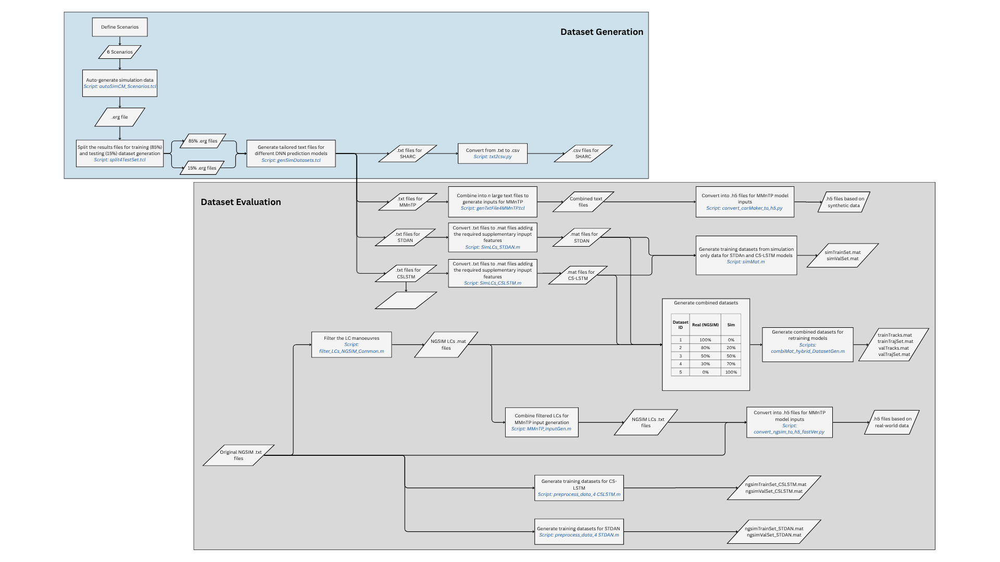

# SHARC Dataset

## A Large Collection of Synthetic Vehicle Trajectory Data on Highway Curves

**SHARC (Synthetic Highway Automotive Road Curves)** is a large-scale synthetic ego-centric automotive trajectory dataset developed for research into deep learning-based vehicle trajectory prediction for automated driving applications.



## Overview

Recent advances in automated driving have led to increasing demand for data-driven trajectory prediction algorithms. However, existing naturalistic driving datasets are often limited by restricted road geometries, limited scenario diversity, and insufficient representation of challenging highway driving conditions such as road curves.

To address these limitations, SHARC provides a large collection of synthetic vehicle trajectories generated under controlled highway driving scenarios with diverse road geometries, including curved highway sections.

## Repository Structure

The repository is organised as follows:

```text
SHARC-Dataset/
│
├── SHARC Generation/
│   ├── Scenario definitions
│   ├── IPG CarMaker configuration files
│   └── Dataset generation scripts
│
├── SHARC Dataset/
│   └── Generated synthetic vehicle trajectory data
│
├── SHARC Evaluation/
│   ├── Evaluation scripts
│   ├── Performance analysis tools
│   └── Result visualisation utilities
│
├── Trajectory Prediction Models/
│   ├── CS-LSTM
│   ├── STDAN
│   ├── MMnTP
│   └── Model training and evaluation implementations
│
└── images/
    └── Dataset workflow diagrams

---

## Dataset Generation

SHARC was generated using **IPG CarMaker**, a high-fidelity vehicle and traffic simulation platform widely used in automotive research and development.

The dataset generation pipeline includes:

- Scenario definition and configuration
- Highway road geometry generation
- Traffic participant modelling
- Ego-vehicle trajectory generation
- Sensor-oriented data extraction
- Data preprocessing and post-processing

The provided repository includes:

- IPG CarMaker scenario definitions
- Scenario configuration files
- Dataset generation scripts
- Data preprocessing utilities
- Evaluation scripts

## Dataset Characteristics

| Characteristic | Description |
|---|---|
| Dataset name | SHARC (Synthetic Highway Automotive Road Curves) |
| Data type | Synthetic ego-centric vehicle trajectory data |
| Simulation environment | IPG CarMaker |
| Driving environment | Multi-lane highways with diverse road geometries |
| Primary scenarios | Highway curved road driving including lane-change manoeuvres |
| Road geometries | Straight and curved highway sections |
| Prediction task | Surround vehicle trajectory prediction |

## Dataset Statistics

The SHARC simulation dataset contains:

- **6,366 lane-change trajectory files**
- Approximately **25 seconds duration per trajectory**
- Balanced distribution of:
  - Left lane changes (LLC)
  - Right lane changes (RLC)

For benchmarking and comparison, SHARC was also evaluated alongside processed naturalistic trajectory data:

- **NGSIM filtered lane-change dataset**: 4,784 lane-change trajectories

## Applications

The SHARC dataset supports research in:

- Deep neural network-based trajectory prediction
- Autonomous driving behaviour modelling
- Sensor configuration optimisation
- Simulation-to-real generalisation studies
- Data-driven automated driving algorithms

## Related Datasets

### NGSIM Naturalistic Driving Dataset

For benchmarking and comparison purposes, SHARC experiments utilise lane-change trajectories extracted from the Next Generation Simulation (NGSIM) dataset.

The original NGSIM vehicle trajectory data are publicly available from the U.S. Department of Transportation Federal Highway Administration (FHWA):

[NGSIM Vehicle Trajectory Data](https://data.transportation.gov/Automobiles/Next-Generation-Simulation-NGSIM-Vehicle-Trajectories/8ect-6jqj)

The NGSIM dataset contains naturalistic vehicle trajectory recordings collected from real-world highway environments. In this work, the original trajectory files were processed to extract lane-change manoeuvres for comparative evaluation.

Note: While NGSIM provides valuable naturalistic driving observations, its highway recordings predominantly represent limited road geometries. SHARC extends this capability by providing controlled synthetic trajectories across diverse highway road curvature scenarios.

## Benchmark Models

SHARC has been evaluated using the following trajectory prediction models:

| Model | Reference |
|---|---|
| CS-LSTM | Deo and Trivedi, 2018 |
| STDAN | Chen et al, 2022 |
| MMnTP | Mozaffari et al, 2023 |

Please cite the original publications when using these models.

